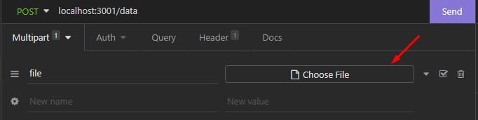

# Teste PG Mais

Repositório criado para registrar resolução do teste proposto pela empresa PG Mais. A explicação do desafio e demais informações estão presentes em: <https://github.com/pgmais/teste-dev>.

## Resumo geral

A aplicação foi construída buscando resolver todas as regras de negócio abordadas. Utilizando uma estrutura base com NodeJS, Express, Typescript e Yarn para gerenciar todos os pacotes necessários. Além disso, foi implementado o middleware Multer para intermediar o recebimento da requisição do arquivo e gerenciamento inicial dessas informações dentro da aplicação.

# Como utilizar a aplicação

## Inicializando o projeto

1. Clone este repositório.
2. Abra o terminal na pasta da aplicação e execute "yarn". Caso não possua yarn instalado em sua máquina
   é necessário o instalar antes desse passo com o comando "npm install -g yarn".
3. Após instalação das dependências do projeto, inicialize a aplicação com o comando "yarn start".

## Enviando arquivo para leitura

Junto ao repositório clonado, temos uma pasta chamada insomnia. Nela, um arquivo chamado "RequestData", esta é nossa requisição ja pré-definida para enviarmos o arquivo a nossa aplicação.

1. Abra o insomnia e importe o arquivo da requisição.
2. Onde temos o input "Choose File" o selecione e escolha um arquivo .csv com as informações no formato presente no repositório origem do teste.

3. Com sua aplicação rodando e o arquivo da requisição definido, basta enviá lo via insomnia e olhar o terminal onde a aplicação esta rodando para obter o retorno.
